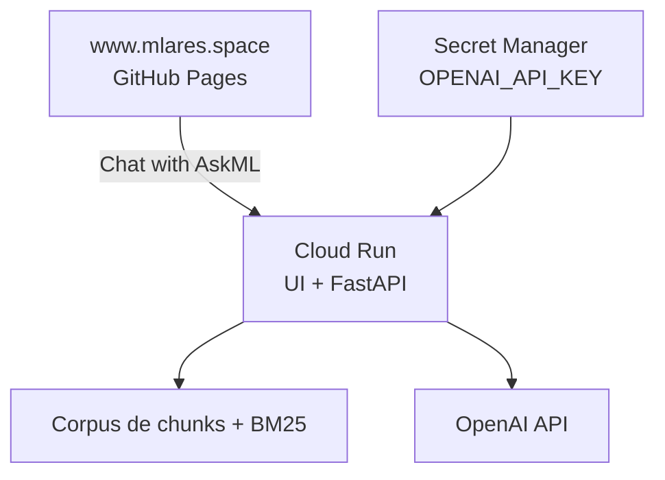

# Desplegar AskML RAG en Google Cloud Run

Este procedimiento publica la aplicación FastAPI como un servicio público de
Cloud Run. El servicio entrega la interfaz web en `/` y el endpoint
`POST /ask`; el sitio personal solo enlaza al chatbot y no contiene la clave
de OpenAI.

La imagen `askml:v1` ya fue subida a Artifact Registry. El digest
`sha256:...` que muestra `docker push` confirma que Artifact Registry recibió
la imagen completa.



## Alcance y requisitos

La imagen contiene el código, los activos estáticos, las dependencias de
ejecución y el corpus evaluado en:

```text
data/processed/chunks/chunks.jsonl
```

El corpus se genera localmente y está ignorado por Git. Antes de construir una
imagen, verifica que exista y que su publicación sea compatible con las
licencias y reglas de visibilidad de todas las fuentes indexadas. No copies
`data/raw/`, PDFs, informes, fuentes privadas ni `.env` a la imagen.

Cloud Run inyecta la variable `PORT`; Uvicorn debe escuchar en
`0.0.0.0:$PORT`, nunca en `127.0.0.1`. La versión `v1` contiene el `EXPOSE
8081` y el comando sin `exec` de una versión anterior. No impide el despliegue
porque Uvicorn usa el `PORT` inyectado por Cloud Run, pero la siguiente imagen
debe corregir ambos detalles.

## 1. Habilitar los servicios necesarios

```bash
gcloud services enable \
  run.googleapis.com \
  secretmanager.googleapis.com \
  artifactregistry.googleapis.com
```

## 2. Crear la identidad de la aplicación

Ejecuta este paso una sola vez. Una cuenta de servicio dedicada evita que el
chatbot use una identidad genérica de ejecución:

```bash
gcloud iam service-accounts create askml-runner \
  --display-name="AskML Cloud Run runtime"
```

La cuenta resultante es:

```text
askml-runner@askml-505521.iam.gserviceaccount.com
```

## 3. Guardar la API key en Secret Manager

Crea el secreto una sola vez:

```bash
gcloud secrets create openai-api-key \
  --replication-policy=automatic
```

Carga la clave desde `.env` sin imprimir su valor:

```bash
set -a
source .env
set +a

test -n "$OPENAI_API_KEY" \
  && echo "OPENAI_API_KEY cargada correctamente" \
  || echo "ERROR: OPENAI_API_KEY no encontrada"
```

Guárdala como una versión del secreto y elimínala de la sesión de terminal:

```bash
printf '%s' "$OPENAI_API_KEY" | \
  gcloud secrets versions add openai-api-key \
    --data-file=-

unset OPENAI_API_KEY
```

`.env` sigue únicamente en el equipo local: no se incorpora a la imagen ni a
Git. Para actualizar una clave, repite solamente el comando
`gcloud secrets versions add` y despliega una nueva revisión que use
`openai-api-key:latest`.

## 4. Permitir que el contenedor lea el secreto

```bash
gcloud secrets add-iam-policy-binding openai-api-key \
  --member="serviceAccount:askml-runner@askml-505521.iam.gserviceaccount.com" \
  --role="roles/secretmanager.secretAccessor"
```

El permiso se aplica solo a este secreto, siguiendo el principio de mínimo
privilegio. Consulta el [control de acceso de Secret
Manager](https://docs.cloud.google.com/secret-manager/docs/access-control).

## 5. Desplegar en Cloud Run

```bash
gcloud run deploy askml \
  --image=southamerica-east1-docker.pkg.dev/askml-505521/askml-images/askml:v1 \
  --region=southamerica-east1 \
  --platform=managed \
  --service-account=askml-runner@askml-505521.iam.gserviceaccount.com \
  --set-secrets=OPENAI_API_KEY=openai-api-key:latest \
  --port=8080 \
  --cpu=1 \
  --memory=512Mi \
  --concurrency=4 \
  --timeout=90 \
  --min=0 \
  --max=2 \
  --allow-unauthenticated
```

La configuración inicial tiene estos efectos:

| Parámetro | Efecto |
| --- | --- |
| `min=0` | No quedan instancias encendidas cuando no hay tráfico. |
| `max=2` | Limita el crecimiento inesperado del servicio. |
| `concurrency=4` | Cada instancia puede procesar hasta cuatro solicitudes concurrentes. |
| `memory=512Mi` | Punto inicial razonable para BM25 y un corpus pequeño. |
| `timeout=90` | Permite esperar la respuesta de OpenAI. |
| `allow-unauthenticated` | Cualquier visitante puede abrir el chatbot. |
| `set-secrets` | La clave se inyecta solo durante la ejecución. |

Cloud Run crea revisiones y escala automáticamente. Las configuraciones mínima
y máxima pueden modificarse después; consulta la [configuración de Cloud
Run](https://docs.cloud.google.com/run/docs/configuring) y el uso de
[secretos en Cloud Run](https://docs.cloud.google.com/run/docs/configuring/services/secrets).

Importante: `max=2` limita el costo de cómputo de Cloud Run, pero no el número
total de consultas ni el gasto de OpenAI. La cuota diaria de preguntas debe
implementarse y almacenarse de manera compartida en la aplicación; el límite
actual en memoria no constituye una cuota global entre instancias.

## 6. Obtener la dirección `run.app`

Al finalizar, `gcloud run deploy` muestra la URL. También se puede recuperar
así:

```bash
SERVICE_URL="$(
  gcloud run services describe askml \
    --region=southamerica-east1 \
    --format='value(status.url)'
)"

printf '%s\n' "$SERVICE_URL"
```

La URL tendrá esta forma:

```text
https://askml-xxxxxxxxxx-rj.a.run.app
```

Usa esa URL pública con HTTPS directamente en el botón de `www.mlares.space`.
La URL actual del servicio es
`https://askml-b2d6wau7ua-rj.a.run.app`.

## 7. Probar el servicio y revisar los logs

Abre `$SERVICE_URL` en el navegador. También se puede verificar que la
interfaz sea accesible sin consumir una solicitud de OpenAI:

```bash
curl -i "$SERVICE_URL/"
```

Los endpoints ligeros `/health` y `/ready` responden sin invocar OpenAI:

```bash
curl -i "$SERVICE_URL/health"
curl -i "$SERVICE_URL/ready"
```

Para una comprobación completa sin costo de modelo, usa el script de smoke test
del repositorio; además valida que el placeholder de respuesta se oculte cuando
el cliente muestra una respuesta:

```bash
SERVICE_URL="$SERVICE_URL" bash scripts/smoke_deployment.sh
```

Si una solicitud falla, revisa los logs:

```bash
gcloud run services logs read askml \
  --region=southamerica-east1 \
  --limit=100
```

También están disponibles en la [consola de Cloud
Run](https://console.cloud.google.com/run?project=askml-505521). No registres
claves, preguntas de visitantes ni contenido del corpus salvo que sea
estrictamente necesario.

## 8. Publicar una imagen corregida

Después del primer despliegue, publica una etiqueta nueva; no reutilices
`v1`. La versión corregida del Dockerfile debe incluir:

```dockerfile
EXPOSE 8080

CMD ["/bin/sh", "-c", "exec uvicorn askml_rag.api:create_app --factory --host 0.0.0.0 --port ${PORT:-8080}"]
```

Construye y publica `v2`:

```bash
docker build -t askml:local .

docker tag askml:local \
  southamerica-east1-docker.pkg.dev/askml-505521/askml-images/askml:v2

docker push \
  southamerica-east1-docker.pkg.dev/askml-505521/askml-images/askml:v2
```

Repite el comando de despliegue de la sección 5 cambiando solo la imagen por
la etiqueta `v2`. Cloud Run conserva `v1` como revisión anterior, por lo que
es posible volver atrás si `v2` falla. Antes de publicar cualquier versión,
ejecuta las pruebas del repositorio, verifica el corpus generado y prueba la
imagen localmente con `.env`.
